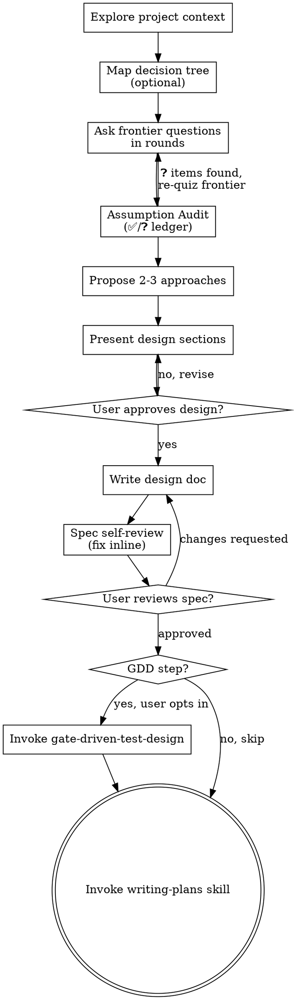

# Brainstorming Ideas Into Designs

Help turn ideas into fully formed designs and specs through natural collaborative dialogue.

Start by understanding the current project context, then clarify decisions in frontier rounds: ask every currently-unblocked question together, each with a recommended answer, then recompute the frontier after the user responds. Once you understand what you're building, present the design and get user approval.

<HARD-GATE>
Do NOT invoke any implementation skill, write any code, scaffold any project, or take any implementation action until you have presented a design and the user has approved it. This applies to EVERY project regardless of perceived simplicity.
</HARD-GATE>

## Anti-Pattern: "This Is Too Simple To Need A Design"

Every project goes through this process. A todo list, a single-function utility, a config change — all of them. "Simple" projects are where unexamined assumptions cause the most wasted work. The design can be short (a few sentences for truly simple projects), but you MUST present it and get approval.

## Checklist

You MUST create a task for each of these items and complete them in order:

1. **Explore project context** — check files, docs, recent commits
   - **Knowledge-base retrieval convention:** read `docs/agent-harness/index.md` first, then follow the relevant topic index; do not use global `**/*.md` globs
2. **Map decision tree** — optional, complex tasks only (3+ decision dimensions): sketch the key decision dependencies before questioning
3. **Ask clarifying questions** — work the current frontier in rounds; ask all unblocked decision questions together, each with a recommended answer and reason
   - When domain terms crystallize (user defines a concept, or you propose a precise term to replace fuzzy language), invoke `agent-harness:domain-modeling` to update `CONTEXT.md` inline. If `CONTEXT.md` doesn't exist yet, the skill creates it lazily. Spec output should use `CONTEXT.md` vocabulary and include a `domain_terms` field in frontmatter listing the core terms.
4. **Assumption Audit** — before proposing approaches, list every assumption you're carrying (✅ confirmed / ❓ unconfirmed); convert each ❓ to a decision or rule it out-of-scope
5. **Propose 2-3 approaches** — with trade-offs and your recommendation
6. **Present design** — in sections scaled to their complexity, get user approval after each section
7. **Write design doc** — save to `docs/agent-harness/specs/YYYY-MM-DD-<topic>-design.md` (check if target directory is gitignored before committing; if so, inform user and save anyway)
8. **Spec self-review** — quick inline check for placeholders, contradictions, ambiguity, scope (see below)
9. **User reviews written spec** — ask user to review the spec file before proceeding
10. **Transition to implementation** — invoke writing-plans skill to create implementation plan

## Process Flow



**The terminal state is invoking writing-plans.** Between design approval and writing-plans, you MAY optionally invoke agent-harness:gate-driven-test-design when the user asks for test case generation or the feature carries non-trivial behavior/contract/regression risk. The ONLY skills you invoke after brainstorming are gate-driven-test-design (optional) and writing-plans (required). Do NOT invoke frontend-design, mcp-builder, or any other implementation skill.

## The Process

**Understanding the idea:**

- Check out the current project state first (files, docs, recent commits)
- Before asking detailed questions, assess scope: if the request describes multiple independent subsystems (e.g., "build a platform with chat, file storage, billing, and analytics"), flag this immediately. Don't spend questions refining details of a project that needs to be decomposed first.
- For large tasks (full-stack project, multiple apps, backend + frontend + AI, or likely >8 implementation tasks), do **large-task decomposition** first: present a directory-level **execution map** with the proposed sub-plans and confirmation gates. Do not write a monolithic spec/plan. Default split: infrastructure / backend / frontend / design-polish, adjusted to the project.
- If the project is too large for a single spec, help the user decompose into sub-projects: what are the independent pieces, how do they relate, what order should they be built? Then brainstorm the first sub-project through the normal design flow. Each sub-project gets its own spec → plan → implementation cycle.
- For complex tasks with 3+ decision dimensions, map the **decision tree** before questioning: identify what must be decided first and which later questions depend on each branch. Simple tasks can keep this tree implicit.

**Ask clarifying questions:**

- Build the current **frontier**: every decision whose prerequisites are already settled and can be answered now
- Ask the whole frontier in one round: number each question and include a recommended answer with the reason
- Wait for the user's answers, then recompute the frontier; settled decisions unblock dependent questions for the next round
- If question B depends on question A's answer, B belongs to a later round, not the current one
- Do not force 3+ questions per round: when the real frontier has only one question, ask one question
- Recommended answers are defaults, not constraints: the user may accept, modify, or reject them

**Relentless termination (the frontier must be empty before you move on):**
The questioning phase is done only when the frontier is empty — every branch of the decision tree has been visited and nothing is left silently assumed. "I think I have enough" is NOT a stopping condition if there are still unasked frontier questions. A common failure mode is declaring the design "clear enough" while decisions remain implicit; the grilling discipline is to keep asking until each assumption is either turned into an explicit decision or ruled out as out-of-scope. If you are tempted to skip a question because "the user probably meant X", ask the question instead — that is the silent assumption you are about to bake into the spec.

**Hard rule:** If the frontier is not empty, you MUST NOT proceed to Propose approaches or Present design. "I think I have enough" is not a substitute for an empty frontier.

**Fact-checking rules:**

- Separate **facts** from **decisions**
- Facts are things you can look up: project file structure, existing API endpoints, config files, codebase patterns
- Decisions require human judgment: technology choices, business logic, product trade-offs, design preferences
- Facts are your job: use tools or dispatch subagents to check them; never ask the user for facts you can inspect
- Do not block unnecessarily: while a fact-finding subagent runs, keep asking frontier questions that do not depend on that fact
- Only questions downstream of an unresolved fact wait for the fact-finding result

**When the user cannot answer a frontier question (to-questionnaire escape hatch):**

A frontier question may require knowledge the user doesn't hold (domain SME, customer insight, product decision owned elsewhere). When the user clearly signals they cannot answer — "I need to ask X", "I'm not sure", "this depends on what the team decides" — do NOT guess, do NOT drop the question, and do NOT force the user to invent an answer. Instead, turn the unanswerable question into a questionnaire for whoever holds the knowledge.

**Grill the send, not the subject.** Interview the user only about what they can always answer — who the questionnaire goes to, and what the user needs back. Then write a Markdown questionnaire that targets the gap.

1. **Who is it going to?** Ask, in one exchange, the recipient's role, expertise, and relationship to the user. This fixes tone and how much context the document must carry. Done when you know who the recipient is and what they know that the user doesn't.
2. **What do you need back?** Ask, in one exchange, the specific decisions or facts the user can't resolve alone and needs from this person. Done when you have a concrete list of what the user must walk away able to do or decide.
3. **Write the questionnaire.** Draft questions aimed at the gap from steps 1–2, using the format below. Write it to `docs/agent-harness/handoffs/to-<recipient>-<slug>.md` where `<recipient>` is the recipient's role or team (e.g. `to-pm-`, `to-finance-`, `to-sre-`), not a personal name, and `<slug>` is kebab-cased from the topic. Create the directory if missing. Report the path to the user. Done when the file exists and every item the user named in step 2 is covered by a question.

**Question format inside the questionnaire** (use these exact markers so the recipient can scan):

~~~
❓ **Q1** - **<question title>**: <question body, might be multiple paragraphs, including multiple choices>

➡️ <what the user needs from the recipient to decide>
~~~

**Pause, don't abandon.** The frontier node that triggered the questionnaire stays paused until the user returns with answers. Other unblocked frontier nodes may proceed in parallel. When the user comes back, recompute the frontier with the new answers.

**Document skeleton** (adapt to context):

~~~
# Questionnaire: <topic>

**Purpose:** why this questionnaire exists and the decision riding on it.
**From:** <the user> — **To:** <recipient role> — **How answers will be used:** <where they go>
**Deadline / effort:** <if known>

## Context
One paragraph orienting a recipient who wasn't in the user's head.

## <Theme heading>
### ❓ Q1 - **<title>**: <body>
➡️ <what's needed>

## Anything else?
A closing catch-all.
~~~

**Do NOT trigger this branch speculatively.** Only when the user has clearly said they can't answer. If you're unsure whether the user can answer, ask them directly ("can you answer this, or should we turn it into a questionnaire for someone else?") rather than assuming either way.

**Exploring approaches:**

- Propose 2-3 different approaches with trade-offs
- Present options conversationally with your recommendation and reasoning
- Lead with your recommended option and explain why
- YAGNI ruthlessly — remove unnecessary features from every approach and design

**Assumption Audit (mandatory gate before presenting the design):**

Before you present a design, do one final pass over everything you think you know and produce an **assumption ledger**. For each assumption, mark it as one of:

- ✅ **Confirmed** — the user explicitly decided this (cite the round/answer if useful)
- ❓ **Unconfirmed** — you inferred this but never asked. Each ❓ MUST be asked before the design is presented; either convert it to a decision (ask the user now) or explicitly rule it out-of-scope.

Format the ledger as a short bulleted list and put it in front of the user:

> **Assumptions I'm carrying into the design:**
> - ✅ <confirmed assumption>
> - ❓ <unconfirmed assumption> — "is this correct?" → recommended answer + reason

The audit is a forcing function, not theater. If you find yourself writing "✅ user obviously wants X" without a concrete prior answer, downgrade it to ❓ and ask. The goal of this gate is that **no silent assumption crosses into the spec** — every premise is either explicitly held by the user or explicitly carved out as out-of-scope. This is the single biggest difference between a spec that survives implementation and one that drifts.

If the audit surfaces more than 2-3 ❓ items, return to the frontier-questioning phase for one more round rather than dumping a long audit list — the frontier mechanism exists precisely to batch these.

**Presenting the design:**

- Once you believe you understand what you're building, present the design
- Scale each section to its complexity: a few sentences if straightforward, up to 200-300 words if nuanced
- Ask after each section whether it looks right so far
- Cover: architecture, components, data flow, error handling, testing
- Keep units isolated and understandable: each component should have one clear purpose, explicit dependencies, and boundaries a reader can understand without reading internals
- Be ready to go back and clarify if something doesn't make sense

**Working in existing codebases:**

- Explore the current structure before proposing changes. Follow existing patterns.
- Where existing code has problems that affect the work (e.g., a file that's grown too large, unclear boundaries, tangled responsibilities), include targeted improvements as part of the design - the way a good developer improves code they're working in.
- Don't propose unrelated refactoring. Stay focused on what serves the current goal.

## After the Design

**Documentation:**

- Write the validated design (spec) to `docs/agent-harness/specs/YYYY-MM-DD-<topic>-design.md`
  - (User preferences for spec location override this default)
- Every spec document must start with YAML frontmatter before the title:

```yaml
---
spec_topic: <topic-from-docs-agent-harness-index>
decision_summary: "<one sentence decision summary>"
design_approved: true
user_approved_at: <ISO-8601 timestamp>
gates: [user-review-passed]
---
```

- Use a real topic from `docs/agent-harness/index.md`; if this is a new topic, add it to the index before running `validate-handoff.sh`.
- Use elements-of-style:writing-clearly-and-concisely skill if available
- Commit the design document to git

**Structural pre-validation (hard gate):** after writing the spec document and before entering self-review, you MUST run:
```bash
scripts/validate-handoff.sh --stage spec --file <spec-path>
```
If the exit code is non-zero, return to the Documentation step to complete the frontmatter/fields and **do not** enter Spec self-review.

**Spec Self-Review:**
After writing the spec document, look at it with fresh eyes:

1. **Placeholder scan:** Any "TBD", "TODO", incomplete sections, or vague requirements? Fix them.
2. **Internal consistency:** Do any sections contradict each other? Does the architecture match the feature descriptions?
3. **Scope check:** Is this focused enough for a single implementation plan, or does it need decomposition?
4. **Ambiguity check:** Could any requirement be interpreted two different ways? If so, pick one and make it explicit.

Fix any issues inline. No need to re-review — just fix and move on.

- After Spec self-review passes, run structural validation and emit the phase metric based on the result (non-blocking):
  ```bash
  if scripts/validate-handoff.sh --stage spec --file "$SPEC"; then
    scripts/log-phase-metric.sh --phase brainstorming --action gate --gate-result passed --spec-topic "$SPEC_TOPIC"
  else
    scripts/log-phase-metric.sh --phase brainstorming --action gate --gate-result failed --spec-topic "$SPEC_TOPIC"
  fi
  ```

**User Review Gate:**
After the spec review loop passes, ask the user to review the written spec before proceeding:

> "Spec written and committed to `<path>`. Please review it and let me know if you want to make any changes before we start writing out the implementation plan."

Wait for the user's response. If they request changes, make them and re-run the spec review loop. Only proceed once the user approves.

**Sprint Contract:**
After spec approval, before invoking writing-plans, use `agent-harness:sprint-contract` to negotiate explicit Definition of Done. This prevents the common failure mode of "completed but not what was expected."

Skip sprint contract only for changes that meet ALL of these criteria:
- **Scope**: single file, < 15 lines changed
- **Risk**: no architecture decisions, no new API surface, no behavioral change to existing logic
- **Clarity**: the user's request is unambiguous and the implementation path is obvious
Examples of valid skips: typo fixes, pure documentation changes, renaming a variable, updating a constant value.
If unsure whether a change qualifies, default to running sprint contract.

**Implementation:**
- Invoke the writing-plans skill to create a detailed implementation plan
- Do NOT invoke any other skill. writing-plans is the next step.

## Clarification Loop Circuit-Breaker (issue #83)

If the user rejects your proposed options **3 times in a row** (clear rejection
signals — "不对" / "不行" / "重新" / "no" / "not what I meant" / "that's not
it" / "try again" / a hesitant "嗯..." followed by a different question / any
response that says "this isn't what I want, try something else" regardless of
language), **stop listing more options**. Listing more variants of the same
shape does not converge — it inflates context with zero-output turns (hack
session 90b1b2fd hit 45.6% no-tool turns this way).

Judge by intent, not by keyword matching — a user can reject without using any
of the example phrases. If you're unsure whether something was a rejection,
ask directly ("is this a no?") rather than treating an ambiguous turn as
neither yes nor no.

**Switch strategy immediately:**

1. Stop generating option lists.
2. Ask one open-ended outcome question: "能描述一下你最终想看到的结果是什么
   样子吗？不用管可行性。" / "Describe the end result you want to see, ignoring
   feasibility for now."
3. If the user still can't describe it, recommend handoff:
   - `agent-harness:office-hours` to re-align on goals, or
   - pause and ask the user to gather more context before continuing.
4. Only resume option-listing once the user has described the desired outcome
   in their own words.

## Six Forcing Questions (Product Ideas)

When brainstorming a **new product idea** or **major new feature** (not bug fixes or small improvements), use these six forcing questions to validate the idea before diving into design. These questions expose assumptions and prevent building things nobody wants.

**When to use:** User says "I have an idea", "is this worth building", "help me think through this", or describes a new product/feature concept.

**How to use:** Ask these during the frontier questioning phase when they are decision questions. Do not use them to ask for facts the agent can inspect. Not every question needs a long answer — some can be quick. But each must be addressed.

| # | Question | What It Exposes |
|---|----------|-----------------|
| 1 | **Demand Reality** — Who specifically has this problem, and how do you know? Have you talked to them? | Prevents building for imagined users |
| 2 | **Status Quo** — How do people solve this problem today? What's wrong with that? | Reveals if the pain is real and if alternatives exist |
| 3 | **Desperate Specificity** — Who would be *desperate* for this? Describe them precisely. | Forces narrow focus vs. "everyone would want this" |
| 4 | **Narrowest Wedge** — What's the smallest possible version that solves the core problem? | Prevents scope creep before validation |
| 5 | **Observation** — What have you personally observed that makes you believe this is needed? | Distinguishes insight from assumption |
| 6 | **Future-Fit** — If this works, what does it grow into? If it fails, what did you learn? | Tests strategic thinking and learning mindset |

**After the six questions:** If the idea survives scrutiny, proceed to normal brainstorming (approaches, design, spec). If the questions reveal weak foundations, help the user either:
- Pivot to a stronger version of the idea
- Identify what research/validation is needed first
- Decide to shelve the idea

**Skip these questions for:**
- Bug fixes
- Small improvements to existing features
- Technical refactoring
- Implementation of already-validated requirements

## Capture Learnings

**After design approval**, if you discovered something worth remembering:

- User stated a strong preference (naming, style, architecture approach)
- Discovered a project convention not documented elsewhere
- Made an architectural decision with non-obvious rationale

Record it using `session-learnings` skill so future sessions respect these decisions.
