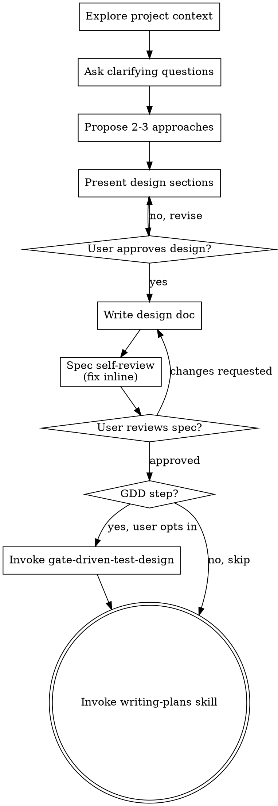

# Brainstorming Ideas Into Designs

Help turn ideas into fully formed designs and specs through natural collaborative dialogue.

Start by understanding the current project context, then ask questions one at a time to refine the idea. Once you understand what you're building, present the design and get user approval.

<HARD-GATE>
Do NOT invoke any implementation skill, write any code, scaffold any project, or take any implementation action until you have presented a design and the user has approved it. This applies to EVERY project regardless of perceived simplicity.
</HARD-GATE>

## Anti-Pattern: "This Is Too Simple To Need A Design"

Every project goes through this process. A todo list, a single-function utility, a config change — all of them. "Simple" projects are where unexamined assumptions cause the most wasted work. The design can be short (a few sentences for truly simple projects), but you MUST present it and get approval.

## Checklist

You MUST create a task for each of these items and complete them in order:

1. **Explore project context** — check files, docs, recent commits
   - **知识库检索约定**：先读 `docs/agent-harness/index.md`，再按主题跳到子目录 index.md，禁止 `**/*.md` 全局通配
2. **Ask clarifying questions** — one at a time, understand purpose/constraints/success criteria
3. **Propose 2-3 approaches** — with trade-offs and your recommendation
4. **Present design** — in sections scaled to their complexity, get user approval after each section
5. **Write design doc** — save to `docs/agent-harness/specs/YYYY-MM-DD-<topic>-design.md` (check if target directory is gitignored before committing; if so, inform user and save anyway)
6. **Spec self-review** — quick inline check for placeholders, contradictions, ambiguity, scope (see below)
7. **User reviews written spec** — ask user to review the spec file before proceeding
8. **Transition to implementation** — invoke writing-plans skill to create implementation plan

## Process Flow



**The terminal state is invoking writing-plans.** Between design approval and writing-plans, you MAY optionally invoke agent-harness:gate-driven-test-design when the user asks for test case generation or the feature carries non-trivial behavior/contract/regression risk. The ONLY skills you invoke after brainstorming are gate-driven-test-design (optional) and writing-plans (required). Do NOT invoke frontend-design, mcp-builder, or any other implementation skill.

## The Process

**Understanding the idea:**

- Check out the current project state first (files, docs, recent commits)
- Before asking detailed questions, assess scope: if the request describes multiple independent subsystems (e.g., "build a platform with chat, file storage, billing, and analytics"), flag this immediately. Don't spend questions refining details of a project that needs to be decomposed first.
- For large tasks (full-stack project, multiple apps, backend + frontend + AI, or likely >8 implementation tasks), do **大型任务分段** first: present a directory-level **execution map** with the proposed sub-plans and confirmation gates. Do not write a monolithic spec/plan. Default split: infrastructure / backend / frontend / design-polish, adjusted to the project.
- If the project is too large for a single spec, help the user decompose into sub-projects: what are the independent pieces, how do they relate, what order should they be built? Then brainstorm the first sub-project through the normal design flow. Each sub-project gets its own spec → plan → implementation cycle.
- For appropriately-scoped projects, ask questions one at a time to refine the idea
- Prefer multiple choice questions when possible, but open-ended is fine too
- Only one question per message - if a topic needs more exploration, break it into multiple questions
- Focus on understanding: purpose, constraints, success criteria

**Exploring approaches:**

- Propose 2-3 different approaches with trade-offs
- Present options conversationally with your recommendation and reasoning
- Lead with your recommended option and explain why

**Presenting the design:**

- Once you believe you understand what you're building, present the design
- Scale each section to its complexity: a few sentences if straightforward, up to 200-300 words if nuanced
- Ask after each section whether it looks right so far
- Cover: architecture, components, data flow, error handling, testing
- Be ready to go back and clarify if something doesn't make sense

**Design for isolation and clarity:**

- Break the system into smaller units that each have one clear purpose, communicate through well-defined interfaces, and can be understood and tested independently
- For each unit, you should be able to answer: what does it do, how do you use it, and what does it depend on?
- Can someone understand what a unit does without reading its internals? Can you change the internals without breaking consumers? If not, the boundaries need work.
- Smaller, well-bounded units are also easier for you to work with - you reason better about code you can hold in context at once, and your edits are more reliable when files are focused. When a file grows large, that's often a signal that it's doing too much.

**Working in existing codebases:**

- Explore the current structure before proposing changes. Follow existing patterns.
- Where existing code has problems that affect the work (e.g., a file that's grown too large, unclear boundaries, tangled responsibilities), include targeted improvements as part of the design - the way a good developer improves code they're working in.
- Don't propose unrelated refactoring. Stay focused on what serves the current goal.

## After the Design

**Documentation:**

- Write the validated design (spec) to `docs/agent-harness/specs/YYYY-MM-DD-<topic>-design.md`
  - (User preferences for spec location override this default)
- Use elements-of-style:writing-clearly-and-concisely skill if available
- Commit the design document to git

**结构前置校验（硬门禁）**：spec 文档提交后、进入 self-review 之前，必须跑：
```bash
scripts/validate-handoff.sh --stage spec --file <spec-path>
```
退出码非 0 时，回到「Documentation」步骤补全 frontmatter / 字段，**不得**进入 Spec self-review。

**Spec Self-Review:**
After writing the spec document, look at it with fresh eyes:

1. **Placeholder scan:** Any "TBD", "TODO", incomplete sections, or vague requirements? Fix them.
2. **Internal consistency:** Do any sections contradict each other? Does the architecture match the feature descriptions?
3. **Scope check:** Is this focused enough for a single implementation plan, or does it need decomposition?
4. **Ambiguity check:** Could any requirement be interpreted two different ways? If so, pick one and make it explicit.

Fix any issues inline. No need to re-review — just fix and move on.

- Spec self-review 通过后，跑结构校验并按结果 emit 阶段指标（不阻断）：
  ```bash
  if scripts/validate-handoff.sh --stage spec --file "$SPEC"; then
    scripts/log-phase-metric.sh --phase brainstorming --action gate --gate-result passed --spec-topic "$SPEC_TOPIC"
  else
    scripts/log-phase-metric.sh --phase brainstorming --action gate --gate-result failed --spec-topic "$SPEC_TOPIC"
  fi
  ```

**User Review Gate:**
After the spec review loop passes, ask the user to review the written spec before proceeding:

> "Spec written and committed to `<path>`. Please review it and let me know if you want to make any changes before we start writing out the implementation plan."

Wait for the user's response. If they request changes, make them and re-run the spec review loop. Only proceed once the user approves.

**Sprint Contract:**

After spec approval, before invoking writing-plans, use `agent-harness:sprint-contract` to negotiate explicit Definition of Done. This prevents the common failure mode of "completed but not what was expected."

Skip sprint contract only for changes that meet ALL of these criteria:
- **Scope**: single file, < 15 lines changed
- **Risk**: no architecture decisions, no new API surface, no behavioral change to existing logic
- **Clarity**: the user's request is unambiguous and the implementation path is obvious

Examples of valid skips: typo fixes, pure documentation changes, renaming a variable, updating a constant value.
If unsure whether a change qualifies, default to running sprint contract.

**Implementation:**

- Invoke the writing-plans skill to create a detailed implementation plan
- Do NOT invoke any other skill. writing-plans is the next step.

## Key Principles

- **One question at a time** - Don't overwhelm with multiple questions
- **Multiple choice preferred** - Easier to answer than open-ended when possible
- **YAGNI ruthlessly** - Remove unnecessary features from all designs
- **Explore alternatives** - Always propose 2-3 approaches before settling
- **Incremental validation** - Present design, get approval before moving on
- **Be flexible** - Go back and clarify when something doesn't make sense

## Six Forcing Questions (Product Ideas)

When brainstorming a **new product idea** or **major new feature** (not bug fixes or small improvements), use these six forcing questions to validate the idea before diving into design. These questions expose assumptions and prevent building things nobody wants.

**When to use:** User says "I have an idea", "is this worth building", "help me think through this", or describes a new product/feature concept.

**How to use:** Ask these questions one at a time during the "Ask clarifying questions" phase. Not every question needs a long answer — some can be quick. But each must be addressed.

| # | Question | What It Exposes |
|---|----------|-----------------|
| 1 | **Demand Reality** — Who specifically has this problem, and how do you know? Have you talked to them? | Prevents building for imagined users |
| 2 | **Status Quo** — How do people solve this problem today? What's wrong with that? | Reveals if the pain is real and if alternatives exist |
| 3 | **Desperate Specificity** — Who would be *desperate* for this? Describe them precisely. | Forces narrow focus vs. "everyone would want this" |
| 4 | **Narrowest Wedge** — What's the smallest possible version that solves the core problem? | Prevents scope creep before validation |
| 5 | **Observation** — What have you personally observed that makes you believe this is needed? | Distinguishes insight from assumption |
| 6 | **Future-Fit** — If this works, what does it grow into? If it fails, what did you learn? | Tests strategic thinking and learning mindset |

**After the six questions:** If the idea survives scrutiny, proceed to normal brainstorming (approaches, design, spec). If the questions reveal weak foundations, help the user either:
- Pivot to a stronger version of the idea
- Identify what research/validation is needed first
- Decide to shelve the idea

**Skip these questions for:**
- Bug fixes
- Small improvements to existing features
- Technical refactoring
- Implementation of already-validated requirements

## Capture Learnings

**After design approval**, if you discovered something worth remembering:

- User stated a strong preference (naming, style, architecture approach)
- Discovered a project convention not documented elsewhere
- Made an architectural decision with non-obvious rationale

Record it using `session-learnings` skill so future sessions respect these decisions.
